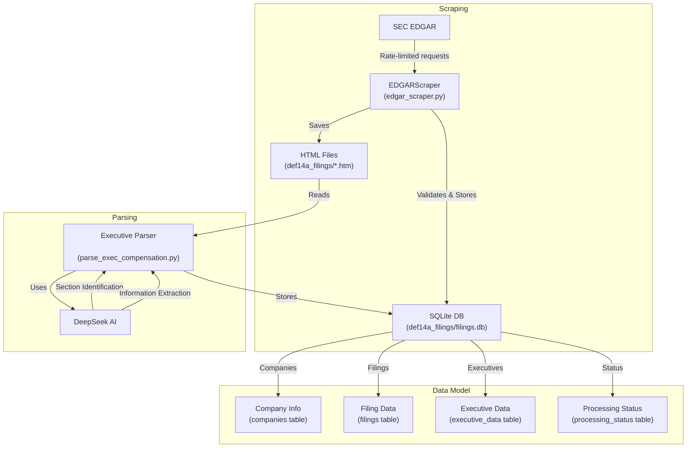
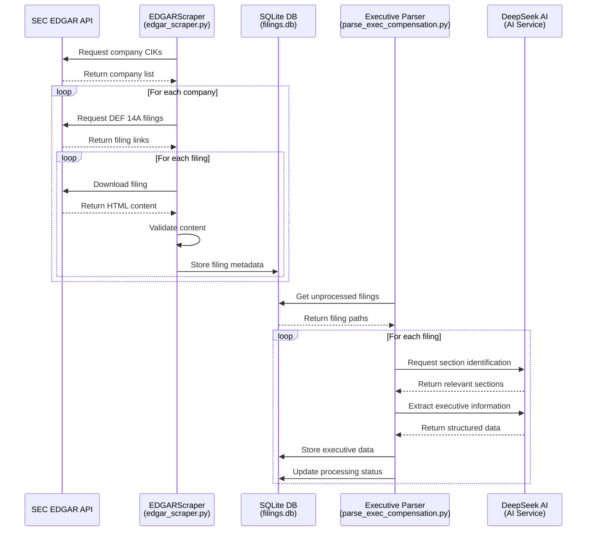

# System Architecture

## Data Flow



## Component Interaction



## System Components

### EDGARScraper (edgar_scraper.py)

- **Responsibility**: Downloads and validates DEF 14A filings
- **Key Features**:
  - Rate limiting
  - Content validation
  - Multi-threading
  - Progress tracking

### Executive Parser (parse_exec_compensation.py)

- **Responsibility**: Extracts structured data from filings
- **Key Features**:
  - AI-powered extraction
  - Section identification
  - Data validation
  - Error handling

### SQLite Database (def14a_filings/filings.db)

- **Responsibility**: Persistent storage
- **Tables**:
  - Companies
  - Filings
  - Executive Data
  - Processing Status

### DeepSeek AI Integration

- **Responsibility**: Intelligent text analysis
- **Functions**:
  - Section identification
  - Information extraction
  - Data structuring

## Error Handling and Recovery

```mermaid
graph TD
    A[Error Occurs] --> B{Error Type}
    B -->|Network| C[Exponential Backoff]
    B -->|Validation| D[Skip & Log]
    B -->|Parsing| E[Mark for Review]

    C --> F[Retry Request]
    F -->|Success| G[Continue]
    F -->|Failure| H[Max Retries]

    D --> I[Next Item]
    E --> I

    H -->|Exceeded| J[Alert & Skip]
    J --> I
