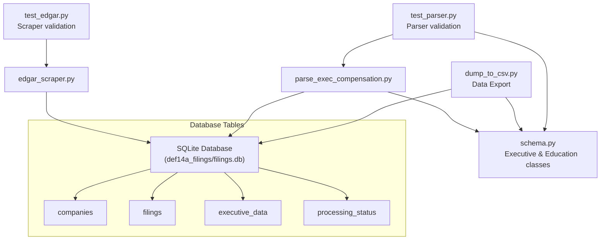

# EDGAR Scraper

## Repository Overview

This repository contains a specialized tool for scraping and analyzing executive compensation data from SEC EDGAR DEF 14A filings (proxy statements). The system is composed of two main components:

1. An EDGAR scraper that downloads and validates proxy statements
2. A compensation parser that extracts structured executive information using AI

## Main Components

### 1. EDGAR Scraper (`edgar_scraper.py`)

- **Primary Purpose**: Downloads and validates DEF 14A filings from SEC EDGAR database
- **Key Features**:
  - Rate-limited requests to comply with SEC guidelines
  - Robust validation of filing content
  - SQLite database for tracking scraping progress
  - Multi-threaded downloading with configurable workers
  - Automatic retry with exponential backoff
  - Comprehensive logging system

### 2. Executive Compensation Parser (`parse_exec_compensation.py`)

- **Primary Purpose**: Extracts structured executive information from proxy statements
- **Key Features**:
  - Uses DeepSeek AI for intelligent section identification
  - Extracts comprehensive executive details including:
    - Compensation data
    - Educational background
    - Career history
    - Board memberships
  - Robust section parsing with multiple heuristics
  - SQLite database for storing extracted data

### 3. Schema Definitions (`schema.py`)

- **Primary Purpose**: Defines data structures for executive information
- **Key Classes**:
  - `Education`: Educational background structure
  - `Executive`: Comprehensive executive profile structure

### 4. Data Export (`dump_to_csv.py`)

- **Primary Purpose**: Exports structured executive data from SQLite to CSV format
- **Key Features**:
  - Combines company and executive information
  - Expands nested education data into flat CSV columns
  - Handles multiple degrees (up to 3 per executive)
  - Converts list fields to semicolon-separated strings
  - Comprehensive field mapping including:
    - Company details (name, CIK)
    - Executive information
    - Compensation data
    - Educational background
    - Board memberships

### 5. Testing Components

- `test_edgar.py`: Validates EDGAR scraping functionality
- `test_parser.py`: Tests the executive information extraction system

## File Dependencies



## Main Entry Points

1. **Primary Scraping Pipeline**:

   ```python
   # edgar_scraper.py
   scraper = EDGARScraper(email)
   scraper.run()  # Scrapes all companies or specific CIKs
   ```

2. **Data Extraction Pipeline**:

   ```python
   # parse_exec_compensation.py
   process_companies()  # Processes all scraped filings
   ```

3. **Data Export Pipeline**:

   ```python
   # dump_to_csv.py
   dump_to_csv()  # Exports to executives.csv by default
   # or
   dump_to_csv('custom_output.csv')  # Export to specific file
   ```

## Technical Details

### Database Schema

The system uses SQLite with the following main tables:

1. `filings`: Tracks downloaded DEF 14A documents
2. `companies`: Stores company information
3. `executive_data`: Contains extracted executive information
4. `processing_status`: Tracks parsing progress

### External Dependencies

- BeautifulSoup4: HTML parsing
- OpenAI/DeepSeek: AI-powered text analysis
- Pandas: Data manipulation
- Requests: HTTP requests
- SQLite: Data storage

### Error Handling

- Comprehensive logging system
- Automatic retries with exponential backoff
- Transaction-based database operations
- Validation at multiple stages

## Development Notes

1. The system is designed to be run in two phases:
   - First, run the scraper to download filings
   - Then, run the parser to extract information

2. The scraper includes rate limiting to comply with SEC guidelines:
   - 0.1 second delay between requests
   - User-agent header with email address

3. The parser uses AI to handle the variability in proxy statement formats:
   - Section identification
   - Information extraction
   - Validation of extracted data

4. Both components are designed to be resumable:
   - Progress tracking in SQLite
   - Skipping already processed items
   - Error state tracking

## Future Improvements

1. Consider implementing:
   - API endpoint for data access
   - Real-time monitoring dashboard
   - Additional filing types beyond DEF 14A
   - Historical trend analysis
   - Export functionality for various formats

2. Potential optimizations:
   - Caching layer for frequently accessed data
   - Parallel processing for parsing
   - Memory optimization for large filings
   - Enhanced error recovery mechanisms
